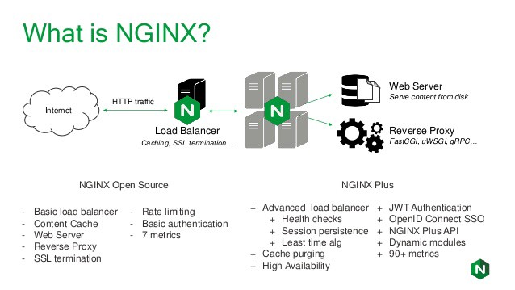
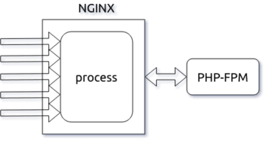

# Nginx - Why and How
**Why Nginx is the talk?:**

* C10k problem - The C10k problem is the problem of optimizing network sockets to handle a large number of clients at the same time [^1]
  * Today is no limit on the number of connections that are being made within the network. To overcome this problem, NGINX was introduced with an **event-driven** and **asynchronous architecture**.

* Traditional process-driven-architecture
  * Earlier, each client request was handled as an individual thread, which becomes complicated to handle the increasing connections. This leads to a delayed response, and the web server slows down. Switching between different threads requires CPU utilization along with extended memory usage and CPU time, which in turn impacts the performance of the website. With NGINX, you can get ten times better performance along with better resource utilization.
 
* Ensure the smooth flow of network traffic between clients and servers as a **Reverse Proxy Server**.[^2]
  * **Load balancing** - A reverse proxy server can act as a “traffic cop,” sitting in front of your backend servers and distributing client requests across a group of servers in a manner that maximizes speed and capacity utilization while ensuring no one server is overloaded, which can degrade performance. If a server goes down, the load balancer redirects traffic to the remaining online servers.
  * **Web acceleration**
    * Reverse proxies can compress inbound and outbound data, as well as **cache** commonly requested content, both of which speed up the flow of traffic between clients and servers. They can also perform additional tasks such as **SSL encryption** to take load off of your web servers, thereby boosting their performance.
    
  * **Security and anonymity**
    * By intercepting requests headed for your backend servers, a reverse proxy server protects their identities and acts as an additional defense against security attacks. It also ensures that multiple servers can be accessed from a single record locator or URL regardless of the structure of your local area network. 
    *  NGINX is well-known for handling tons of incoming requests or HTTP traffic, ensuring application safety during high traffic, common cache response, and deliver request smoothly. NGINX works as a shock absorber for your application. It also controls traffic that will protect the vulnerable APIs and URLs from being overloaded with requests(**DOS**).
  * **Scalability and fault tolerance** 
    * the load balancing, health checks features of NGINX allow you to scale your back-end infrastructure so that adding or removing any microservice will not impact the user’s experience. If you want to deploy more microservices, you only have to inform the NGINX server that you have added a new instance to the load-balanced pool. In case of a failed instance, NGINX will not route the traffic to that instance until it recovers.

**What is Nginx?** 

NGINX is a web server but commonly used as a reverse proxy. It can be scaled efficiently as a web server as well as a reverse proxy. It does not allow you to allocate a process to a particular connection, but it creates a process pool that can be easily shared among multiple connections within the network. Whenever a request is made, a resource will be allocated to the process resulting in better resource utilization that can easily handle extensive connections.
NGINX also helps in setting up a secured connection between your data-centers and the outside network. It also works well as an HTTP load balancer that allows you to use multiple different load-sharing mechanisms. 

A young Russian developer named Igor Sysoev was frustrated by older web servers' inability to handle more than 10 thousand concurrent requests. This is a problem referred to as the C10k problem. As an answer to this, he started working on a new web server back in 2002.

Nginx spawns worker processes, each of which can handle thousands of connections. The worker processes accomplish this by implementing a fast looping mechanism that continuously checks for and processes events. Decoupling actual work from connections allows each worker to concern itself with a connection only when a new event has been triggered.

NGINX is faster in static content delivery while staying relatively lighter on resources because it doesn't embed a dynamic programming language processor. When a request for static content comes, NGINX simply responds with the file without running any additional processes.

That doesn't mean that NGINX can't handle requests that require a dynamic programming language processor. In such cases, NGINX simply delegates the tasks to separate processes such as PHP-FPM, Node.js or Python. Then, once that process finishes its work, NGINX reverse proxies the response back to the client.

**How to Nginx?** 

To understand how NGINX works, we need to understand the important NGINX directories and commands.

* NGINX files and directories
  * **_/etc/nginx/_**
    * The _/etc/nginx/_ directory is the default configuration root for the NGINX server. Within this directory you will find configuration files that instruct NGINX on how to behave.
  * **_/etc/nginx/nginx.conf_**
    * The _/etc/nginx/nginx.conf_ file is the default configuration entry point used by the NGINX service. This configuration file sets up global settings for things like worker process, tuning, logging, loading dynamic modules, and references to other NGINX configuration files. In a default configuration, the /etc/nginx/nginx.conf file includes the top-level http block, or context, which includes all configuration files in the directory described next.
  * **_/etc/nginx/conf.d/_**
    * The _/etc/nginx/conf.d/_ directory contains the default HTTP server configuration file. Files in this directory ending in .conf are included in the top-level http block from within the _/etc/nginx/nginx.conf_ file. It’s best practice to utilize include statements and organize your configuration in this way to keep your configuration files concise.
  

[^1]: https://en.wikipedia.org/wiki/C10k_problem
[^2]: https://www.nginx.com/resources/glossary/reverse-proxy-server/